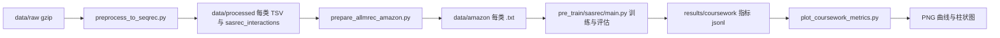

# 实验与报告操作指南

面向：**负责训练、调参、跑验证/测试、整理图表、撰写实验报告**的同学。本文按当前代码入口整理；如果旧实验记录与代码不一致，以脚本参数和 [PROJECT_STATUS.md](PROJECT_STATUS.md) 为准。

### 总体数据流（从原始数据到报告图）



---

## 文档怎么分工

| 文档 | 适合做什么 |
|------|------------|
| [PROJECT_STATUS.md](PROJECT_STATUS.md) | 当前项目状态、已有/缺失数据、代码入口关系、A-LLMRec 扩展条件 |
| [README.md](../README.md) | 环境、最短命令、入口脚本索引 |
| **本页（EXPERIMENT_GUIDE）** | 实验流程清单、命令速查、报告要写什么、产物路径 |
| [COURSEWORK_DATA_AND_EVAL.md](COURSEWORK_DATA_AND_EVAL.md) | N−2/N−1/N 划分、TSV 字段、NDCG@10/HR@10 与代码对应关系 |

---

## 实验前检查清单

在仓库根目录逐项确认（避免跑空或路径错）：

1. **conda 环境**：`conda activate llmrec`，且 `python -c "import torch; print(torch.__version__)"` 正常。
2. **数据是否存在**  
   - 已有 `data/amazon/<类别>.txt` → 可直接跑 SASRec，这是当前工作区的状态。  
   - 只有 `data/processed/<类别>/`（含 `train.tsv`、`dev.tsv`、`test.tsv`、`sasrec_interactions.txt`）→ 先跑 `prepare_allmrec_amazon.py`。  
   - 只有 `data/raw/` 下 gzip → 先跑 `preprocess_to_seqrec.py`（见 README）。
3. **扁平交互**：SASRec 训练实际读取 `data/amazon/<类别>.txt`（**该目录不提交 Git**，克隆后不一定存在）。
4. **训练入口**：SASRec 必须用 **`pre_train/sasrec/main.py`**；根目录 **`main.py` 是 A-LLMRec**，不要混用参数。
5. **GPU/CPU**：有 GPU 用 `--device cuda:0`；无 GPU 用 `--device cpu`（会慢很多，建议减小 `num_epochs` 或仅做冒烟）。

---

## 一键流程（推荐小组统一）

在**仓库根目录**、已 `activate llmrec`。若当前机器已经有 `data/amazon/*.txt`，直接执行：

```bash
pip install -r requirements.txt
python scripts/run_three_categories_sasrec.py \
  --num_epochs 50 \
  --device cuda:0 \
  --batch_size 256 \
  --n_workers 1 \
  --eval_every 5 \
  --plot
```

若没有 `data/amazon/*.txt` 但已有 `data/processed/<类别>/`，先执行：

```bash
python scripts/prepare_allmrec_amazon.py --overwrite
```

若 `data/processed/` 也没有，请先按 [PROJECT_STATUS.md](PROJECT_STATUS.md) 的“从零开始”流程下载/预处理。

`run_three_categories_sasrec.py` 只透传 `--categories`、`--device`、`--num_epochs`、`--batch_size`、`--n_workers`、`--eval_every`、`--out_dir` 和 `--plot`。若要改 `lr`、`maxlen`、`dropout_rate`、`eval_seed` 等参数，请直接运行 `pre_train/sasrec/main.py`。

完成后请**在本地保存**（默认 **不纳入 Git**：见仓库根目录 `.gitignore`；报告可插图或粘贴指标表）：

- `results/coursework/*_metrics.jsonl`（每行一个 epoch 的指标，可导入 Excel / pandas 做表）
- `results/coursework/metrics_curves_ndcg_hr.png`（需要 `--plot` 或单独运行画图脚本）
- `results/coursework/final_test_ndcg10_hr10_bar.png`（需要 `--plot` 或单独运行画图脚本）
- `pre_train/sasrec/<类别>/SASRec.epoch=*.pth`（若报告需写模型文件大小或路径；当前工作区未保留 checkpoint）

---

## 命令速查（复制到终端）

**单类训练 + 写指标（Linux / macOS，一行）**

```bash
python pre_train/sasrec/main.py --dataset Industrial_and_Scientific --skip_preprocess --device cuda:0 --num_epochs 200 --batch_size 128 --n_workers 1 --eval_every 20 --eval_seed 42 --metrics_jsonl results/coursework/Industrial_and_Scientific_metrics.jsonl
```

**仅重新画图（不重新训练）**

```bash
python scripts/plot_coursework_metrics.py --metrics_dir results/coursework
```

**非交互环境（未 activate）**

```bash
conda run -n llmrec python scripts/plot_coursework_metrics.py --metrics_dir results/coursework
```

Windows PowerShell 多行可用反引号 `` ` `` 续行，或写成一行。

---

## SASRec 常用参数（写进报告「实验设置」）

| 参数 | 含义 | 报告建议写法 |
|------|------|----------------|
| `--dataset` | 类别名，与 `data/amazon/<名>.txt` 一致 | 写明三类各跑一遍或对比 |
| `--skip_preprocess` | 跳过 `pre_train/sasrec/data_preprocess.py`，直接读取 `data/amazon/<dataset>.txt` | 当前课程流程通常需要开启 |
| `--num_epochs` | 训练轮数 | 与曲线横轴一致 |
| `--batch_size` | 训练 batch | 若 OOM 需说明调小 |
| `--lr` | 学习率，默认 0.001 | 若改过需记录 |
| `--maxlen` | 序列最大长度，默认 50 | 影响长序列截断 |
| `--eval_every` | 每隔多少 epoch 做一次验证+测试评估 | 影响 jsonl 行数与曲线密度 |
| `--eval_num_negatives` | 每用户随机负样本数，默认 100 | 候选池大小 = 101；写进「评估协议」 |
| `--eval_seed` | 评估随机种子，默认 42 | 写进「可复现性」 |
| `--metrics_jsonl` | 指标落盘路径 | 附件或仓库路径 |
| `--n_workers` | 采样进程数；Windows 建议 1 | 环境相关可脚注 |

默认模型结构：`--hidden_units 50`、`--num_blocks 2`、`--num_heads 1`、`--dropout_rate 0.5`（与 `pre_train/sasrec/main.py` 一致）。

---

## 验证 vs 测试（写进报告「评估方式」）

用一句话区分，避免和 raw split 文件名混淆：

- **验证集指标**：模型只看到 **训练前缀**，预测 **第 N−1 个**交互（与 `dev.tsv` 目标一致）。  
- **测试集指标**：模型看到 **训练前缀 + 验证目标**，预测 **第 N 个**交互（与 `test.tsv` 目标一致）。  

两者均在 **1 个正样本 + `eval_num_negatives` 个负样本** 上算排名；**HR@10** 表示真实物品排名是否进入前 10；**NDCG@10** 对命中位置用 \(1/\log_2(\mathrm{rank}+2)\) 加权平均（`rank` 为 0-based，详见 [COURSEWORK_DATA_AND_EVAL.md](COURSEWORK_DATA_AND_EVAL.md)）。

用户总数 &gt; 10000 时，评估中**随机抽 10000 用户**（与参考实现一致），报告里可写一句「大规模子采样评估」。

---

## `*_metrics.jsonl` 字段说明（做表 / 画图）

每行一个 JSON，便于 `pandas.read_json(..., lines=True)`：

| 字段 | 类型 | 含义 |
|------|------|------|
| `epoch` | int | 训练轮次 |
| `dataset` | str | 类别名 |
| `valid_ndcg10` | float | 验证集 NDCG@10 |
| `valid_hr10` | float | 验证集 HR@10 |
| `test_ndcg10` | float | 测试集 NDCG@10 |
| `test_hr10` | float | 测试集 HR@10 |

**报告建议**：主结果表用 **最后一轮** 的 `test_ndcg10` / `test_hr10` 做三类别对比；另用曲线展示 `epoch`–指标变化说明是否收敛。

**pandas 读入示例（写报告做表）**：

```python
import pandas as pd
df = pd.read_json("results/coursework/Industrial_and_Scientific_metrics.jsonl", lines=True)
print(df.tail(1))  # 最后一轮指标
```

---

## 实验报告可照搬的结构提示

1. **数据**：`download_amazon5core.py` 默认类别；每用户序列长度 N 与 `data_partition()` 中的 N−2/N−1/N 划分。  
2. **任务**：下一物品预测；特征为交互序列；评价 **NDCG@10、HR@10**。  
3. **模型**：SASRec；默认超参见上表；损失为 BCE（正负样本）。  
4. **实现**：PyTorch；仓库脚本与入口；`llmrec` 环境；硬件（GPU 型号、显存）。  
5. **结果**：三类 `test_ndcg10`/`test_hr10` 表 + 曲线图 + 柱状图（本仓库 `plot_coursework_metrics.py` 产出）。  
6. **讨论**：哪类更难、是否过拟合（valid/test 差距）、训练时间、局限（随机负采样、子采样评估等）。

---

## 常见问题（排错）

| 现象 | 处理 |
|------|------|
| `ambiguous option: --batch_size` | 当前跑的是根目录 A-LLMRec `main.py`；改用 `python pre_train/sasrec/main.py ...` |
| `FileNotFoundError` … `data/amazon` | 若已有 `data/processed/<类别>/`，运行 `python scripts/prepare_allmrec_amazon.py --overwrite`；否则先下载/预处理 raw。 |
| `cached_download` / `huggingface_hub` | `pip install -r requirements.txt`（含 hub 版本上限）；仅 SASRec 训练不需要拉 SBERT |
| 训练很慢 | 减小 `num_epochs`；`--eval_every` 调大；有 GPU 务必 `--device cuda:0` |
| 想换随机负样本协议 | 改 `--eval_num_negatives` 后**全文统一说明**，并与旧结果区分 |

---

## 与「根目录 main.py」的关系

- **SASRec 协同过滤实验**：只用 `pre_train/sasrec/main.py` + 上文产物即可写完整报告。  
- **A-LLMRec 扩展实验**：需先有 SASRec `.pth`、`data/amazon/<类别>_text_name_dict.json.gz` 和模型依赖，再用根目录 `main.py` 的 `--pretrain_stage1` 等；代码限制见 [PROJECT_STATUS.md](PROJECT_STATUS.md)。

若仍不确定从哪条命令开始，优先执行本页 **「一键流程」** 三段命令，再根据 jsonl 与 PNG 写结果章节。
