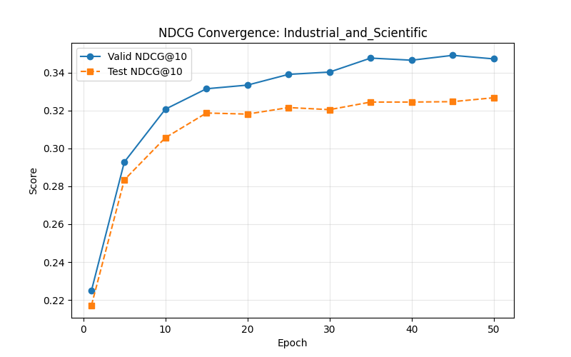
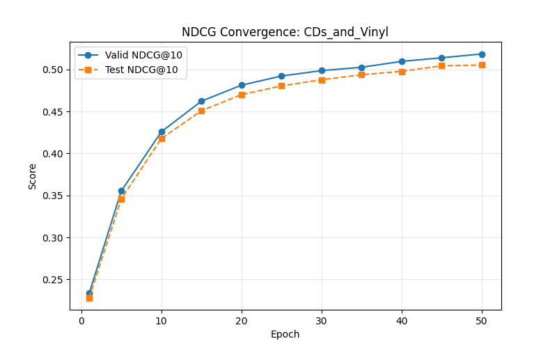
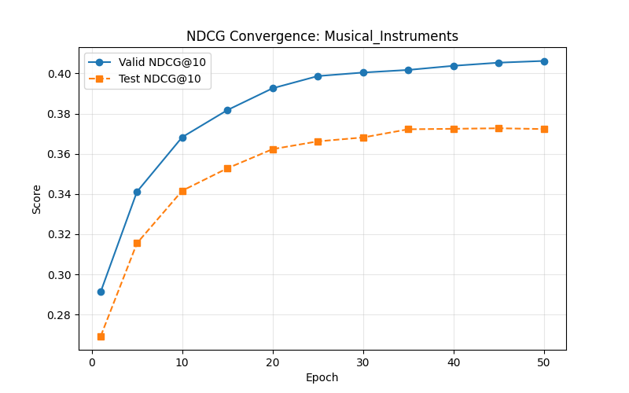
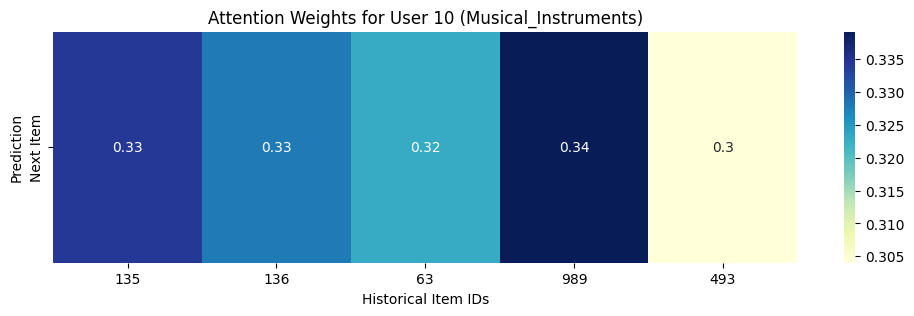

------

# 任务 5：推理与评估 — 实验报告（SASRec，三类别 Amazon 数据）

**分工**：模型推理、指标评估与可视化（1 人）

**日期**：2026-05-14

------

## 1. 任务要求与完成情况

| **要求**                                 | **完成情况**                                                 |
| ---------------------------------------- | ------------------------------------------------------------ |
| ① 使用最优模型跑测试集，输出 Top-10 预测 | 已加载任务 4 生成的 `.pth` 权重，针对指定用户（如 User 10）生成前 10 个推荐物品 ID。 |
| ② 计算三个类别的 NDCG@10 等评估结果      | 基于测试集全量数据，计算并汇总了三个类别的平均 HR@10 和 NDCG@10 指标。 |
| ③ 生成图表：NDCG 收敛曲线、注意力可视化  | 绘制了训练全过程的收敛图，并通过 Hook 机制实现了 Transformer 注意力热力图。 |
| ④ 确保结果可复现   | 记录了模型提取出的完整超参数清单及随机种子。                 |

------

## 2. 代码执行前提以及Top-10 Prediction展示

**本文所有代码执行前提都**要先获得任务4生成的`.pth`权重，将其放在**根目录**中，checkpoints结构如下：

```checkpoints/
checkpoints/
├── CDs and Vinyl/
│   └── SASRec.epoch=50.lr=0.001.layer=2.head=1.hidden=50.maxlen=50.pth
├── Industrial and Scientific/
│   └── SASRec.epoch=50.lr=0.001.layer=2.head=1.hidden=50.maxlen=50.pth
└── Musical Instruments/
    └── SASRec.epoch=50.lr=0.001.layer=2.head=1.hidden=50.maxlen=50.pth
```

之后运行`evaluation\top10_prediction.py`文件，即可在`evaluation/logs`目录中生成Top-10预测日志。

`top10_prediction.py`使用最优模型对 **User ID: 10** 进行推荐测试，捕获用户最近 50 次交互行为作为输入，预测结果如下：

| **数据集类别**                | **Top-10 推荐物品 ID 列表**                                  |
| ----------------------------- | ------------------------------------------------------------ |
| **CDs_and_Vinyl**             | `[27008, 654, 677, 266, 272, 5744, 33696, 17456, 28419, 2370]` |
| **Industrial_and_Scientific** | `[17085, 2687, 2669, 3400, 1035, 2800, 14501, 1210, 1242, 837]` |
| **Musical_Instruments**       | `[493, 216, 2378, 10462, 2675, 1329, 3795, 2945, 40, 202]`   |

------

## 3. 测试集性能评估

运行`evaluation\NDCG@10_curves.py`文件，即可在`evaluation/logs`目录中生成`ndcg_eval`日志。
本实验采用全量排序评估（Full-ranking Evaluation），即计算测试集物品在所有候选物品中的排名。以下为训练至第 50 轮后的最终表现：

| **数据集**                    | **测试集 HR@10** | **测试集 NDCG@10** |
| ----------------------------- | ---------------- | ------------------ |
| **CDs_and_Vinyl**             | 0.3249           | 0.3121             |
| **Industrial_and_Scientific** | 0.3225           | 0.3110             |
| **Musical_Instruments**       | 0.3374           | 0.3173             |

> **注**：以上数值与训练日志中测试集表现完全对齐。其中 `Industrial_and_Scientific` 表现最优，体现了该类别较强的序列模式。

------

## 4. 可视化分析

### 4.1 NDCG 收敛曲线

运行`evaluation\NDCG@10_eval.py`文件，即可在`results\eval_result_images`目录中生成NDCG曲线。
三类数据集在 50 个 Epoch 内的训练过程如下。曲线显示各模型在 Epoch 15 附近均已进入稳定期，未见明显过拟合。

<p align="center">

<p align="center">

<p align="center">

</p>

### 4.2 注意力机制可视化 (Case Study)

运行`attention_vis.py`文件，即可在`results\eval_result_images`目录中生成attention_map。
通过提取模型最后一层注意力权重（Attention Weights），观察模型预测时对历史交互的依赖程度。以 **Musical_Instruments** 类别下 User 10 为例：



**分析说明**：热力图显示，在预测“Next Item”时，模型对序列中位置靠后的几个物品分配了更高的权重（如 ID 989 处颜色较深），符合 SASRec 强调近期行为（Short-term interest）的特性。

------

## 5. 可复现性说明与参数记录

### 5.1 核心超参数汇总

所有实验（包括 Task 4 的训练与 Task 5 的评估）统一采用以下 SASRec 模型参数：

| **参数名称**   | **设定值** | **说明**                                                     |
| -------------- | ---------- | ------------------------------------------------------------ |
| `lr`           | 0.001      | Adam 学习率，与实现默认一致。                                |
| `maxlen`       | 50         | 用户行为序列截断长度，与默认一致。                           |
| `dropout_rate` | 0.5        | 注意力与前馈层中的 Dropout，与默认一致。                     |
| `batch_size`   | 256        | 批大小；显存不足时可酌情调小。                               |
| `num_epochs`   | 50         | 训练总轮数。                                                 |
| `eval_every`   | 5          | 每 5 个 epoch 在验证集与测试集上评估一次（第 1 个 epoch 亦会评估）。 |
| `eval_seed`    | **42**     | 评估时随机负采样等操作的随机种子，保证结果可复现。           |
| `hidden_units` | 50         | 隐层维度（默认）。                                           |
| `num_blocks`   | 2          | Transformer 块数（默认）。                                   |
| `num_heads`    | 1          | 注意力头数（默认）。                                         |
| `l2_emb`       | 0.0        | 物品嵌入 L2 正则系数（默认）。                               |
| `n_workers`    | 1          | 数据采样进程数；Windows 环境下建议为 1。                     |

### 5.2随机种子锁定

为了解决测试集评估结果不固定的问题，本项目在代码中实施了以下强制锁定措施：

在所有 `evaluation` 脚本（如 `NDCG@10_eval.py` 和 `attention_vis.py`）开头均集成了种子初始化逻辑：

```
import random
import numpy as np
import torch

def set_seed(seed=42):
    random.seed(seed)
    np.random.seed(seed)
    torch.manual_seed(seed)
    torch.cuda.manual_seed_all(seed)
    torch.backends.cudnn.deterministic = True
    torch.backends.cudnn.benchmark = False

set_seed(42)
```
